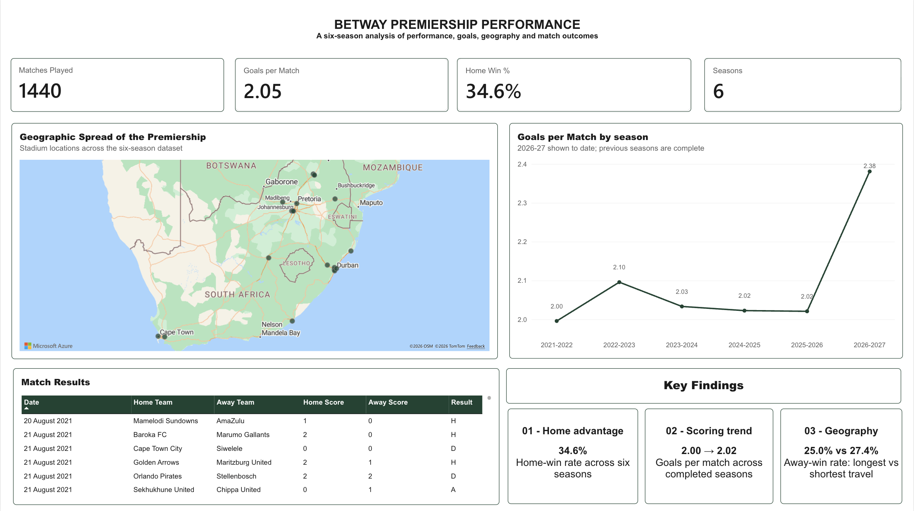
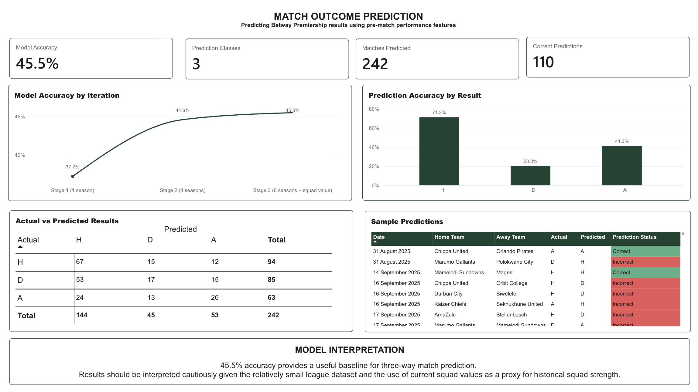

# Betway Premiership: Performance Analysis & Match Prediction

Betway Premiership (South African top-flight football) performance analysis and match outcome prediction project, built as a portfolio piece for football analytics roles. 

## Why this project

Most football analytics portfolio projects focus on the top five European leagues. This project takes a different approach by applying the same analytical principals to the Betway Premiership, a league with considerably less publicly available football analytics. 

The project follows a reproducible:
**question -> data -> features -> model -> conclusion**
workflow using Python and Power BI. 

## Questions 
The project focuses on two main questions:
1. **What does Betway Premiership performance look like across multiple seasons?**
2. **How accurately can match outcomes be predicted using pre-match performance features?**

## Project structure

```text 
sa_football_analysis/
├── data/
│   ├── raw/              
│   └── processed/            
├── src/   
│   ├── export_predictions.py 
│   ├── features.py
│   ├── mismatch.py
│   ├── model.py
│   ├── scrape_matches.py
│   ├── squad_values.py
│   └── teams.py            
├── powerbi/            
└── README.md
```

## Data sources

| Data | Source | Purpose |
|---|---|---|
| Match results and dates | TNT Sports / Eurosport | Match-level results and dates |
| Final league tables | Wikipedia season pages | Points, goal difference and season-level cross-checks |
| Squad market values | Transfermarkt | Proxy for squad strength |
| Stadium coordinates | Manual geocoding | Geographic and travel-distance features |

Match data is collected through the TNT Sports / Eurosport data endpoint and processed into a consistent match-level dataset.

## Feature engineering 
The model uses information available before each match to reduce the risk of data leakage. 

## Pre-match features
- Rolling points over the previous 5 matches
- Rolling points over the previous 10 matches 
- Goal-difference trend
- Travel distance between teams' stadiums 
- Squad market value features 

Rolling form features are calculated using pre-match results only, with previous results shifted before calculating the rolling values.

Travel distance is calculated using stadium latitude and longitude coordinates. 

## Model 
The project uses a chronological train/test split rather than a random split, with approximately 80% of the observations used for training and the remaining 20% used for testing. 

The primary model is a logistic regression classifier predicting three possible match outcomes:
- H - Home win
- D - Draw
- A - Away win

Gradient boosting was also considered as a comparison model. 

## Model progression 
The model was developed iteratively as additional seasons and features were introduced.

| Iteration | Data / Features | Accuracy |
|---|---|---:|
| Stage 1 | 1 season | 37.2% |
| Stage 2 | 4 seasons | 44.6% |
| Stage 3 | 6 seasons + squad value | 45.5% |

The final model achieved 45.5% test accuracy, correctly predicting 110 of 242 test matches. 

The results also show that predictive performance varies considerably by outcome class, with home wins predicted more accurately than draws.

## Dashboard 
The Power BI dashboard is divided into two pages.

## Page 1 - Betway Premiership Performance 
The first page provides a descriptive overview of:
- Matches played
- Goals per match
- Home-win rate
- Geographic distribution of teams
- Goals per match across seasons
- Match-level results 
- Key performance findings 


## Page 2 - Match Outcome Prediction
The second page focuses on the machine-learning component:
- Overall model accuracy 
- Prediction classes
- Number of predictions 
- Correct predictions 
- Model accuracy across iteration
- Prediction accuracy by result 
- Actual vs predicted results 
- Sample match predictions 
- Model interpretation and limitations 


## Key findings

## Performance 
Home teams won 34.6% of matches across the six-season dataset.

Average goals per match remained relatively stable across completed seasons, moving from 2.00 in 2021-22 to 2.02 in 2025-26.

## Geography
Matches involving the longest travle travel distances recorded a lower away-win rate than matches involving the shortest travel distances:

25.0% vs 27.4%

This is an observed association rather than evidence that travel distance directly causes the difference. 

## Prediction
The final model achieved 45.5% accuracy on the chronological test set.

Prediction performance varied by result:
- Home: 71.3%
- Draw: 20.0%
- Away: 41.3%

## Limitations 
The dataset is relatively small compared with major European football leagues, so model results should be interpreted as a baseline rather than a definitive prediction system.

A key limitation is the squad market-value feature. The available values represent a current 2026-27 snapshot and are applied across historical seasons as a rough proxy for squad strength. Historical season-specific market values would provide a more accurate representation of squad strength at the time of each match.

The 2026-27 season is also incomplete and is therefore treated as a season-to-date dataset rather than a completed season.

## Reproducibility 
The project is structured so that data processing, feature engineering and model training can be reproduced through the Python pipeline.

The workflow is:
Raw match data
      ↓
Data cleaning
      ↓
Feature engineering
      ↓
Chronological train/test split
      ↓
Model training
      ↓
Prediction evaluation
      ↓
Power BI dashboard

## Stack
- Python
- pandas
- scikit-learn
- Power BI

Python is used for data collection, cleaning, feature engineering and modelling, while Power BI is used for interactive analysis and presentation.

## AI Assistance

AI tools were used selectively during the development of this project to assist with debugging, code refinement, documentation, and problem-solving. All analytical decisions, feature selection, model evaluation, and conclusions were reviewed and validated as part of the project development process.

